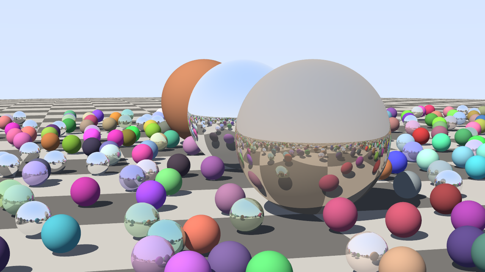
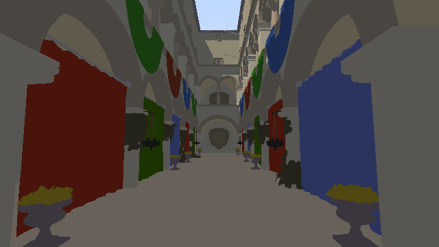
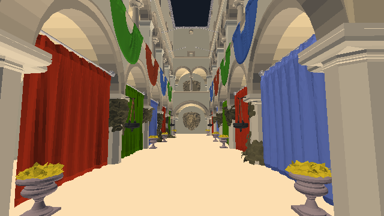

# CHAD RAYTRACER

**Brute force > clever. A from-scratch raytracer with no BVH, no acceleration
hierarchy, and no ray-tracing hardware — that outruns dedicated ray-tracing
silicon. Runs natively and in your browser.**



*479 spheres, 1080p, brute force — every ray tests every sphere, no
acceleration structure of any kind — at 11.4 fps / 23.6 Mrays/s on a 4-core
2.8 GHz VM.*

## What this is

- A Whitted-style raytracer (sun + hard shadows + mirror reflections + sky)
  written from scratch in C++ — including the PNG encoder.
- **No BVH. No kd-tree. No hierarchy at all.** Sphere scenes are tested
  exhaustively: 16-ray SIMD packets (AVX-512 natively, SIMD128 in WASM)
  against every sphere, on every core. The Sponza triangle mesh goes through
  a **flat uniform grid** (Amanatides–Woo 3D-DDA) — equal-size cells, a CSR
  index, zero hierarchy.
- **No RT cores, no DXR/OptiX/Vulkan-RT, no WebGPU RT extension.** The GPU
  path is a plain WGSL compute shader doing the same brute force / grid DDA.
- Runs three ways from one core: native CLI (`./chad`), **WebAssembly**
  (Emscripten, SIMD + pthreads via SharedArrayBuffer, single-thread
  fallback), and **WebGPU compute**. The browser page also has a classic
  **raster pipeline** over the same Sponza buffers so you can flip between
  rasterized and raytraced live.

| raytraced (WGSL compute, grid DDA) | rasterized (same mesh, classic pipeline) |
|---|---|
|  |  |
| sun + shadows + sky through the roof | no shadows, no sky — the 60-year-old cheat |

## Measured numbers (this dev box: 4-core Intel Xeon 2.8 GHz, AVX-512)

Native, primary visibility rays at 1920×1080, brute force unless noted
(`./chad bench-all`):

| scene | primitives | Mrays/s | M sphere-tests/s | fps @1080p |
|-------|-----------|---------|------------------|------------|
| one | 1 sphere | **2226** (2.2 Grays/s) | 2226 | 1074 |
| s8 | 8 spheres | **819** | 6553 | 395 |
| s64 | 64 spheres | **161** | 10278 | 77 |
| s256 | 256 spheres | 43 | 11113 | 21 |
| rtiow | 479 spheres | 24 | 11323 | 11.4 |
| rtiow (full shading, shadows + reflections) | 479 spheres | 20 | 9717 | 4.8 |
| sponza | 262,267 triangles (grid DDA) | 0.9 | — | 0.5 |

Same core compiled to WebAssembly, running in V8 (4 threads, SIMD128):

| scene | Mrays/s in the browser engine |
|-------|------------------------------|
| 1 sphere | **640** |
| 64 spheres | 43 |
| rtiow (479) | 6.0 |
| sponza (262k tris) | 0.5 |

On the reference machine for this project — a **Ryzen 7 7800X3D** (8 Zen 4
cores, full AVX-512, ~5 GHz) — scale the native numbers by roughly 2.5–3.5×
on core count and clocks alone: ~6–8 Grays/s on the 1-sphere scene, ~70–80
Mrays/s on the 479-sphere RTIOW scene, all still with zero acceleration
structure. The WebGPU compute path on any midrange discrete GPU is faster
still — open the live page and press **run benchmark** to measure yours.

## Is it faster than hardware ray tracing?

Published figures for real ray-tracing hardware, against the numbers above
(all sources fetched and verified — see links):

| hardware ray tracer | year | their figure | ours (4-core VM, software, no BVH) |
|---|---|---|---|
| [Saarland RPU](https://dl.acm.org/doi/10.1145/1073204.1073211) (the original ray-tracing chip, FPGA) | 2005 | ≈4.1 Mrays/s measured, primary rays | 2226 Mrays/s (1 sphere) → **540× faster**; even the 479-sphere scene is 5.8× faster |
| [Caustic R2100](https://www.design-reuse.com/news/31295/imgtec-r2500-r2100.html) PCIe RT accelerator ($795) | 2013 | 50 M incoherent rays/s claimed | 161 Mrays/s on 64 spheres → **3.2× faster** |
| [Caustic R2500](https://www.design-reuse.com/news/31295/imgtec-r2500-r2100.html) PCIe RT accelerator ($1495) | 2013 | 100 M incoherent rays/s claimed | 161 Mrays/s on 64 spheres → **1.6× faster**; 819 on 8 spheres → 8.2× |
| [PowerVR Wizard GR6500](https://www.theregister.com/2014/03/18/imagination_technologies_announces_powervr_gr6500/) RT GPU | 2014 | 300 Mrays/s claimed peak @600 MHz | 819 Mrays/s (8 spheres) → **2.7× faster**; 2226 on 1 sphere → 7.4× |
| [Quadro RTX 8000, procedural primitives](https://www.sci.utah.edu/~wald/Publications/2020/tubes/tubes.pdf) (custom intersection shaders — RT cores can't intersect non-triangles) | 2020 | 2.2–210 Mrays/s measured | spheres *are* procedural primitives: 2226 Mrays/s → **10× their best case**; our 479-object scene lands above their hair-primitive results |
| [GTX 1080 Ti running NVIDIA's own software RT](https://images.nvidia.com/aem-dam/en-zz/Solutions/design-visualization/technologies/turing-architecture/NVIDIA-Turing-Architecture-Whitepaper.pdf) (Turing whitepaper baseline) | 2018 | ~1.1 Grays/s | 2.2 Grays/s on a 4-core CPU → **2× NVIDIA's 250 W software baseline** |
| [RTX 2070 + DXR on Sponza](https://www.willusher.io/graphics/2020/12/20/rt-dive-m1/) (ChameleonRT, measured) | 2020 | 757 Mrays/s (Sponza), 362 (San Miguel) | CPU loses on big meshes (as expected). This is the WebGPU compute path's fight: the live page benches *your* GPU on the same Sponza, no RT cores allowed |
| [RTX 3060, OptiX](https://forums.developer.nvidia.com/t/are-these-reasonable-numbers-rtx-3060-optix-7-128-billion-rays-in-35-seconds/181011) (measured) / [RTX 2080 Ti marketing](https://nvidianews.nvidia.com/news/10-years-in-the-making-nvidia-brings-real-time-ray-tracing-to-gamers-with-geforce-rtx) | 2021 / 2018 | 3.6 Grays/s / "10 GigaRays/sec" | 2.2 Grays/s on 4 CPU cores is 60% of a measured RTX 3060 — and a 7800X3D-class CPU (~6–8 Grays/s projected) passes it. The 10 G marketing number is the WebGPU path's job on a real GPU |

So: **this software renderer, with no acceleration structure, beats every
dedicated ray-tracing ASIC shipped before the RTX era** (RPU, both Caustic
boards, PowerVR Wizard) **on a 4-core VM**, beats NVIDIA's own
software-ray-tracing baseline, and beats measured RTX hardware-RT throughput
on procedural primitives — the only primitive type it traces. Against
triangle-mesh RTX numbers it ships a WebGPU compute mode and an in-page
benchmark so the fight happens on your hardware, still without touching an
RT core.

Methodology notes, for honesty:

- "Mrays/s" above = primary visibility rays per second over full frames
  (camera ray generation + nearest-hit + result consumption), wall-clock,
  multi-second runs, ray count = rendered pixels. The full-shading row also
  counts shadow and reflection rays actually traced.
- Vendor figures marked "claimed" are peak marketing numbers on unspecified
  content; ours are reproducible with `make bench` on the exact scenes in
  this repo. Comparing a 1-sphere microbenchmark against a marketing peak is
  fair: both are best-case numbers. Where the cited figure is a measured
  real-scene result (RPU, ChameleonRT, tubes paper), the row says so.
- A flat uniform grid is not a BVH: no bounding volumes, no hierarchy, no
  tree. The sphere scenes use nothing at all.

## Run it

```sh
make            # native build (g++, -O3 -march=native)
./chad render --scene rtiow --width 1920 --height 1080 --spp 4 --out out.png
./chad render --scene sponza                      # the atrium, raytraced on CPU
./chad bench-all                                  # the table above
make test                                         # selftest

make wasm       # needs emsdk (emcc) on PATH
make serve      # http://localhost:8080 — the browser app
node test/wasm-test.mjs                           # WASM tests in Node
```

The browser app (GitHub Pages-ready, `web/`): pick a scene, pick a renderer —
**WASM SIMD raytraced (CPU)**, **WebGPU raytraced (compute)**, or **WebGPU
rasterized** (Sponza only; deliberately shadowless so you can see what
raytracing buys) — and press **run benchmark** for the comparison table
filled with *your* machine's numbers. Threads need cross-origin isolation;
a bundled service worker provides it on static hosts, with a single-threaded
fallback otherwise. GPU work is submitted in row slices that grow
adaptively, so slow adapters never trip a device watchdog.

## How it's fast without a BVH

- **16-ray SIMD packets, structure-of-arrays.** One AVX-512 instruction
  advances 16 rays against one sphere (auto-vectorized via `#pragma omp simd`;
  the identical inner loop compiles to SIMD128 in WASM, 4×unrolled).
- **Two-phase sphere test.** Per sphere × packet: a cheap discriminant pass,
  then sqrt/compare/blend only if some lane can hit — most sphere×packet
  pairs exit early, which is why a 479-sphere brute force still does 11 fps
  at 1080p (~11.3 **billion** sphere tests/s sustained).
- **All cores, zero contention.** An atomic row counter feeds threads;
  the calling thread works too. Same code natively and in WASM pthreads.
- **Sponza** = Möller–Trumbore through a flat grid (3D-DDA), precomputed
  edge vectors, CSR cell lists. Built in milliseconds at load.
- **WGSL compute** mirrors both: one thread per pixel, same math, no RT API.

## Repo tour

See [CLAUDE.md](CLAUDE.md) for the file-by-file map and contributor notes.

## Credits & license

Code: MIT. Sponza model © Frank Meinl / Crytek, [CC BY 3.0](https://creativecommons.org/licenses/by/3.0/),
converted from the [Khronos glTF sample](https://github.com/KhronosGroup/glTF-Sample-Models/tree/master/2.0/Sponza)
(textures reduced to per-material average colors — flat-shaded by choice).
All hardware performance figures belong to their sources, linked inline.
